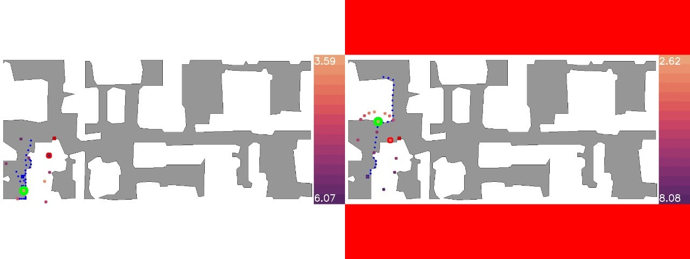
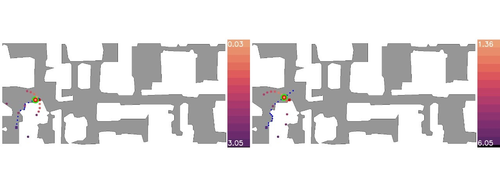
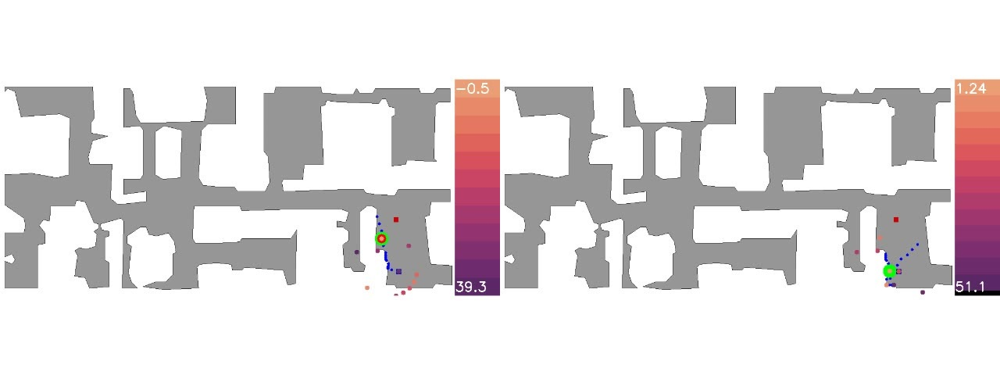
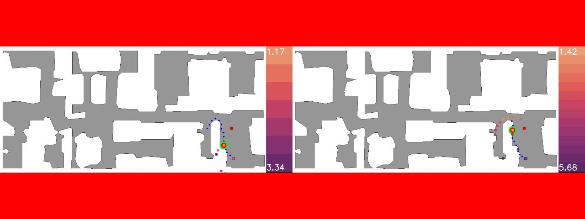
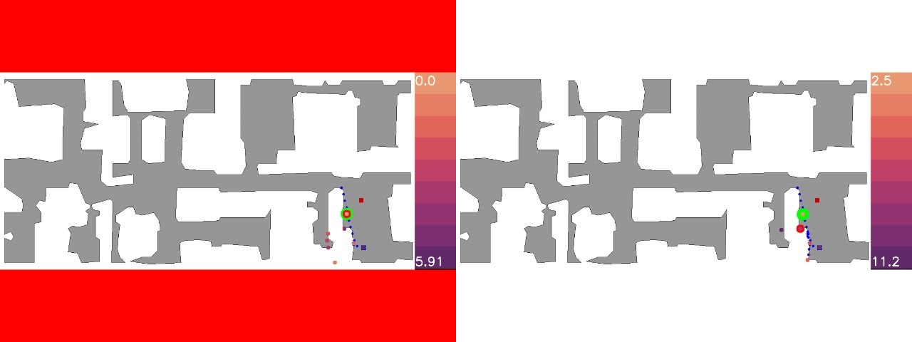
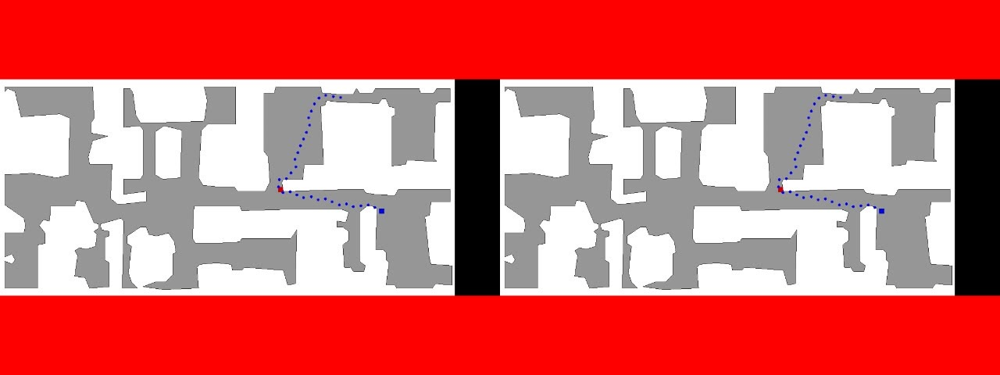
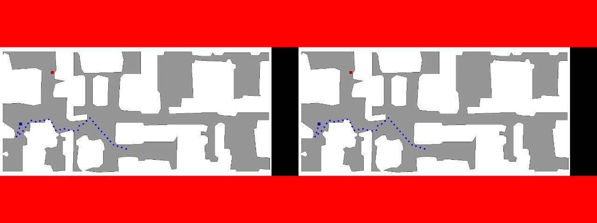
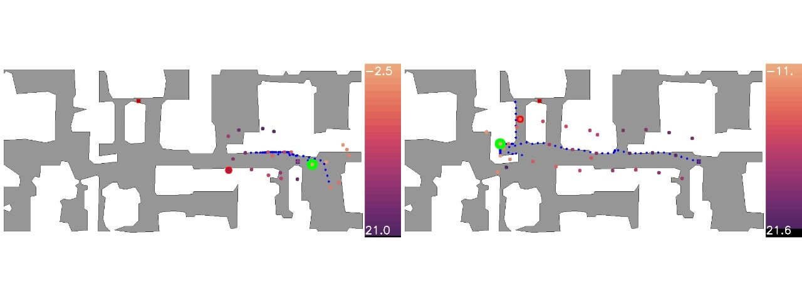
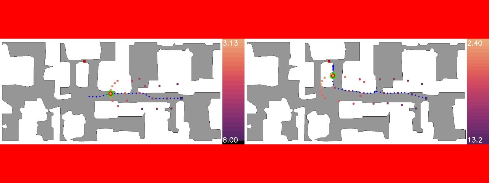
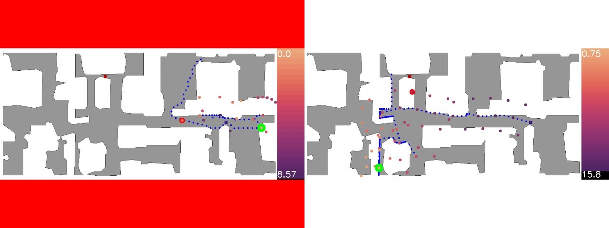

# Notes
1. Red circle around a ghost node means it is the GT closest node to goal
2. Green circle around a ghost node means it is what the given method selected
3. When red appears as the border, NRNS beleives it is close to the goal and stops exploring using ghost nodes
4. The left video is Distance(x) + TC, the right video is Distance(x)

# Experiments
## **gibson/easy/straight**

Baseline
 

<source src="../images/nrns2/Cat/old/gibson/straight/easy/Cantwell_40.mp4" type="video/mp4">
<video controls width="640" align="left">
<source src="../images/nrns2/Cat/old/gibson/straight/easy/Cantwell_40.mp4" type="video/mp4">
</video>

Ground Truth
 

<source src="../images/nrns2/Cat/gt/gibson/straight/easy/Cantwell_40.mp4" type="video/mp4">
<video controls width="640" align="left">
<source src="../images/nrns2/Cat/gt/gibson/straight/easy/Cantwell_40.mp4" type="video/mp4">
</video>

[0,1] Clipping
 

<source src="../images/nrns2/Cat/new/gibson/straight/easy/Cantwell_40.mp4" type="video/mp4">
<video controls width="640" align="left">
<source src="../images/nrns2/Cat/new/gibson/straight/easy/Cantwell_40.mp4" type="video/mp4">
</video>

## **gibson/easy/curved**

Baseline
 

<source src="../images/nrns2/Cat/old/gibson/curved/easy/Cantwell_15.mp4" type="video/mp4">
<video controls width="640" align="left">
<source src="../images/nrns2/Cat/old/gibson/curved/easy/Cantwell_15.mp4" type="video/mp4">
</video>

Ground Truth
 

<source src="../images/nrns2/Cat/gt/gibson/curved/easy/Cantwell_15.mp4" type="video/mp4">
<video controls width="640" align="left">
<source src="../images/nrns2/Cat/gt/gibson/curved/easy/Cantwell_15.mp4" type="video/mp4">
</video>

[0,1] Clipping
 

<source src="../images/nrns2/Cat/new/gibson/curved/easy/Cantwell_15.mp4" type="video/mp4">
<video controls width="640" align="left">
<source src="../images/nrns2/Cat/new/gibson/curved/easy/Cantwell_15.mp4" type="video/mp4">
</video>

## **gibson/medium/straight**

Baseline
 

<source src="../images/nrns2/Cat/old/gibson/straight/medium/Cantwell_40.mp4" type="video/mp4">
<video controls width="640" align="left">
<source src="../images/nrns2/Cat/old/gibson/straight/medium/Cantwell_40.mp4" type="video/mp4">
</video>

Ground Truth
 

<source src="../images/nrns2/Cat/gt/gibson/straight/medium/Cantwell_40.mp4" type="video/mp4">
<video controls width="640" align="left">
<source src="../images/nrns2/Cat/gt/gibson/straight/medium/Cantwell_40.mp4" type="video/mp4">
</video>

[0,1] Clipping
 

<source src="../images/nrns2/Cat/new/gibson/straight/medium/Cantwell_40.mp4" type="video/mp4">
<video controls width="640" align="left">
<source src="../images/nrns2/Cat/new/gibson/straight/medium/Cantwell_40.mp4" type="video/mp4">
</video>

## **gibson/medium/curved**

Baseline
 

<source src="../images/nrns2/Cat/old/gibson/curved/medium/Cantwell_3.mp4" type="video/mp4">
<video controls width="640" align="left">
<source src="../images/nrns2/Cat/old/gibson/curved/medium/Cantwell_3.mp4" type="video/mp4">
</video>

Ground Truth
 

<source src="../images/nrns2/Cat/gt/gibson/curved/medium/Cantwell_3.mp4" type="video/mp4">
<video controls width="640" align="left">
<source src="../images/nrns2/Cat/gt/gibson/curved/medium/Cantwell_3.mp4" type="video/mp4">
</video>

[0,1] Clipping
 

<source src="../images/nrns2/Cat/new/gibson/curved/medium/Cantwell_3.mp4" type="video/mp4">
<video controls width="640" align="left">
<source src="../images/nrns2/Cat/new/gibson/curved/medium/Cantwell_3.mp4" type="video/mp4">
</video>

## **gibson/hard/straight**

Baseline
 

<source src="../images/nrns2/Cat/old/gibson/straight/hard/Cantwell_13.mp4" type="video/mp4">
<video controls width="640" align="left">
<source src="../images/nrns2/Cat/old/gibson/straight/hard/Cantwell_13.mp4" type="video/mp4">
</video>

Ground Truth
 

<source src="../images/nrns2/Cat/gt/gibson/straight/hard/Cantwell_13.mp4" type="video/mp4">
<video controls width="640" align="left">
<source src="../images/nrns2/Cat/gt/gibson/straight/hard/Cantwell_13.mp4" type="video/mp4">
</video>

[0,1] Clipping
 

<source src="../images/nrns2/Cat/new/gibson/straight/hard/Cantwell_13.mp4" type="video/mp4">
<video controls width="640" align="left">
<source src="../images/nrns2/Cat/new/gibson/straight/hard/Cantwell_13.mp4" type="video/mp4">
